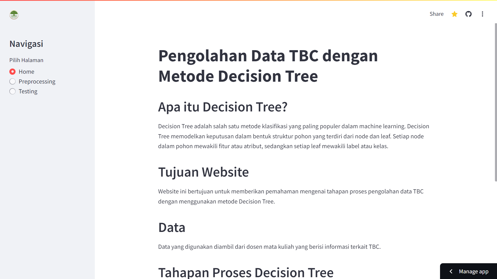
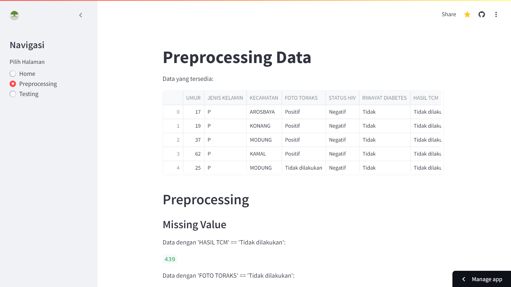
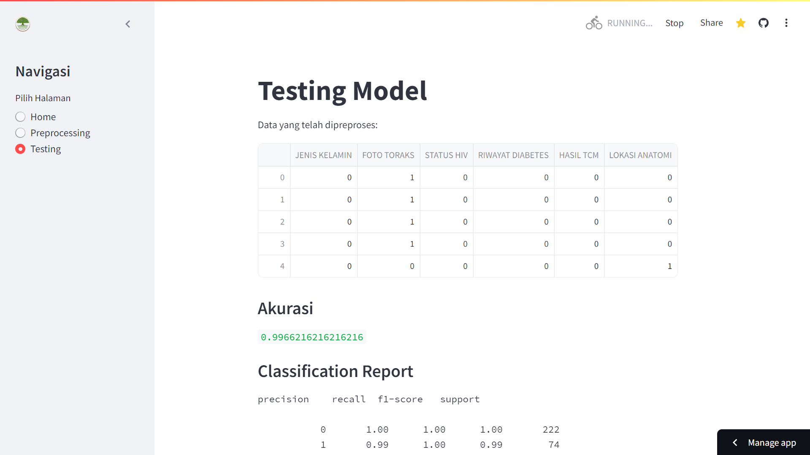

# Web Komputasi TB dengan Decision Tree

Aplikasi web ini dikembangkan menggunakan metode Decision Tree untuk menganalisis data Tuberkulosis (TB). Dengan antarmuka yang intuitif, pengguna dapat dengan mudah memproses data, melakukan preprocessing, dan menguji hasil prediksi. Web ini dibangun dengan menggunakan Streamlit dan dideploy di Streamlit.app.

## Halaman Utama

Halaman utama menyediakan pengantar singkat tentang aplikasi, serta navigasi ke halaman-halaman lain seperti preprocessing dan testing.

## Halaman Preprocessing

Halaman ini memungkinkan pengguna untuk membersihkan dan mempersiapkan data Tuberkulosis sebelum dilakukan analisis. Langkah-langkah preprocessing yang tersedia meliputi penanganan data hilang, normalisasi, dan encoding.

## Halaman Testing

Di halaman ini, pengguna dapat menguji model Decision Tree yang telah dilatih menggunakan data yang telah diproses. Pengguna dapat memasukkan data baru untuk melihat hasil prediksi dan akurasi model.

## Teknologi yang Digunakan

- **Streamlit:** Framework Python yang digunakan untuk membuat aplikasi web interaktif dengan cepat.
- **Streamlit.app:** Platform hosting untuk deploy aplikasi Streamlit.

## Gambaran Web

## Definisi Web

Aplikasi web ini dirancang untuk memudahkan analisis data Tuberkulosis menggunakan metode Decision Tree. Dengan antarmuka yang ramah pengguna, aplikasi ini membantu pengguna dalam melakukan preprocessing data dan menguji model prediksi secara efisien. Aplikasi ini bermanfaat bagi peneliti, tenaga kesehatan, dan akademisi yang ingin melakukan analisis data TB secara cepat dan akurat.
